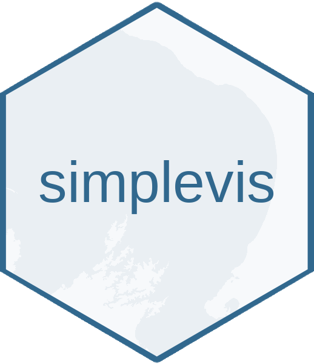

<!-- badges: start -->
  
  
  
  
  
  <!-- badges: end -->

# simplevis

### Purpose

`simplevis` is a package of `ggplot2` and `leaflet` wrapper functions that aims to make visualisation easier with less brainpower required.

### Installation

Install stable version from CRAN:
`install.packages("simplevis")`

Install development version from github:
`devtools::install_github("statisticsNZ/simplevis")`

### Documentation

Webpage URL:

https://statisticsnz.github.io/simplevis/

R vignette:

`vignette("simplevis", "simplevis")`

---
__Copyright and Licensing__

The package is Crown copyright (c) 2020, Statistics New Zealand on behalf of the New Zealand Government, and is licensed under the MIT License.

  This document is Crown copyright (c) 2020, Statistics New Zealand on behalf of the New Zealand Government, and is licensed under the Creative Commons Attribution 4.0 International License. To view a copy of this license, visit https://creativecommons.org/licenses/by/4.0/ or send a letter to Creative Commons, PO Box 1866, Mountain View, CA 94042, USA.
